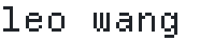
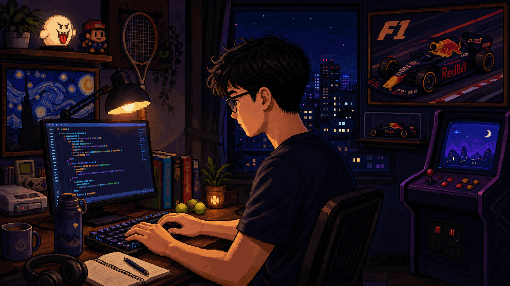

<h1>
  <picture>
    <source media="(prefers-color-scheme: dark)" srcset="assets/name-dark.svg">
    <source media="(prefers-color-scheme: light)" srcset="assets/name-light.svg">
    
  </picture>
</h1>

Systems Design Engineering @ Waterloo · prev. engineering intern @ Shopify

## side quests 🛠️

- [Tilde](https://github.com/Le0wang06/Tilde) — keep tabs on your AI agents, spend, and pending decisions from the macOS menu bar.
- [Screen Translation Workspace](https://github.com/Le0wang06/screen-translation-workspace) — turn product screenshots into translated screens and editable steps.
- [Focus Intent](https://github.com/Le0wang06/focus-intent) — a Chrome extension to get you back to what you opened your browser for.

  <a href="assets/leo-room-collectibles.png" title="Open a still version of Leo's room">
    <picture>
      <source media="(prefers-reduced-motion: reduce)" srcset="assets/leo-room-collectibles.png">
      
    </picture>
  </a>

